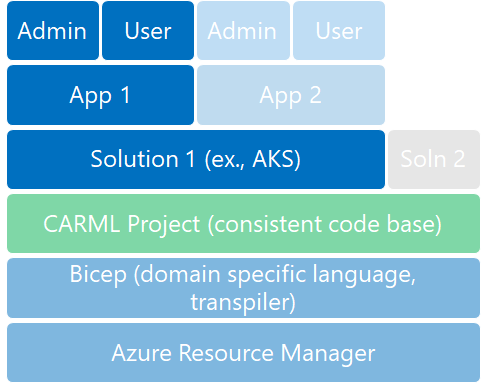
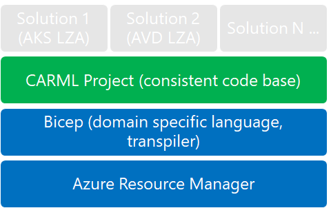

# CARML Personas

## Solution Consumer

  

### Activities

- Clone or reference the multi-module solution (ex., AKS Landing Zone Accelerator)
- Understand the reference architecture, key decisions 
- Update parameters to include organization and environment specific data
- Deploy the template

### Benefits

- Start with known good reference implementations
- Consume Microsoft and organization-specific guidance
- Improve time to value for workload administrators and users

## Solution Developer

  

### Activities

- Create (dev, integration test, publish) multi-module solutions for specific reference patterns (workloads, applications, environments)
- If necessary, can modify (dev, unit test, publish) existing modules to implement organization-specific standards

### Benefits

- Codify the reference pattern (guidance, decisions, governance)
- Focus on the reference pattern requirements.
- Can adopt the toolkit’s infra-as-code guidance.  
- Simplify downstream usage by application/workload teams

## Module Developer

  

### Activities

- Create, update modules for Azure resources.  
- Incorporate new resource provider capabilities, and extensions
- Improve documentation
- Improve continuous integration
- Requires in depth knowledge of CARML, Bicep, ARM, DevOps and infra-as-code

### Benefits

- Contributes to building and maintaining a common code base. Particularly beneficial to customer that have an Enterprise or Distributed Operating model.
