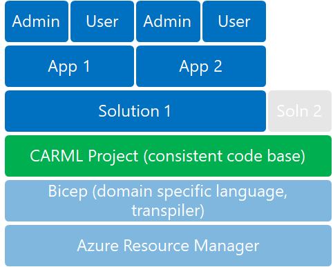

# CARML Personas

## Solution Consumer

  

Indirect persona.  User not necessarily Developer.  Focus is on implementing an end-to-end solution.  Versus building one.  Can consume via registry, package, etc.  Perhaps even via wizard or click to deploy button.  Will need to understand the configuration data (parameters) required – and the optionals.  Will need to understand the architecture and opinion.

- This persona isn’t really consuming CARML directly.  They are consuming CARML via another solution:
- Ex., AKS Landing Zone Accelerator
- Ex., internally developed (within Contoso) L3 patterns

### Activities

- Clone or reference the multi-module solution (ex., AKS Landing Zone Accelerator)
- Understand the reference architecture, key decisions
- Update parameters to include organization and environment specific data
- Deploy the template

### Benefits

- Start with known good reference implementations
- Consume Microsoft and organization-specific guidance
- Improve time to value for workload administrators and users

## Solution Developer

  

Developer not User.  Focus is on using CARML to build end-to-end solutions.  That are opinionated.  That will be published for consumption by others.  That will be used many times (many orgs, many teams, many environments/subs/lzs).  Required to use the CARML library (public or org/customer specific implementation).  Should develop a preference for registry (public, private).  Might benefit the most from overcoming the learning curve – because the standardization and scale they can achieve with CARML.

- Modules:  Use existing to develop and test a multi-module solution (ex., a Landing Zone Accelerator, or an internal platform/workload team).  Might lead to creating/updating modules.
- CI:  Use CI to improve multi-module dev/test?  Might lead to improving CI.
- Sample 1:  A contrived multi-module solution (L3 patterns?) using modules that make sense together and deploy quickly but not necessarily a reference architecture
- Sample 2:  The simplest reference architecture on Azure Architecture Center.  
- Existing CARML solutions:  links to real world uses (AKS, etc).  These links provide examples of real world solutions using CARML.  Vs the previous sample which illustrate how within the project.

### Activities

- Create (dev, integration test, publish) multi-module solutions for specific reference patterns (workloads, applications, environments)
- If necessary, can modify (dev, unit test, publish) existing modules to implement organization-specific standards

### Benefits

- Codify the reference pattern (guidance, decisions, governance)
- Focus on the reference pattern requirements.
- Can adopt the toolkit’s infra-as-code guidance.  
- Simplify downstream usage by application/workload teams

## Module Developer

  

Developer not User.  Focus is on CARML itself.  Wants to add org/company specifics to the library (either via convention/parameters, or extensions, or CI).  Wants to do so in a way that could contribute back upstream (into CARML for world).  Is tasked with improving the library – for org/customer or world.  Is tasked with helping the CARML Solution Developer (see next).

- Modules:  Create new.  Update existing.  
- CI:  Improve CI
- Sample 1:  A simple resource, with CARML extensions, deploys fast.  
- Sample 2:  A complex resource, with CARML extensions, child resources, “smart defaults”, PowerShell style “scenario” documentation

### Activities

- Create, update modules for Azure resources.  
- Incorporate new resource provider capabilities, and extensions
- Improve documentation
- Improve continuous integration
- Requires in depth knowledge of CARML, Bicep, ARM, DevOps and infra-as-code

### Benefits

- Contributes to building and maintaining a common code base. Particularly beneficial to customer that have an Enterprise or Distributed Operating model.
